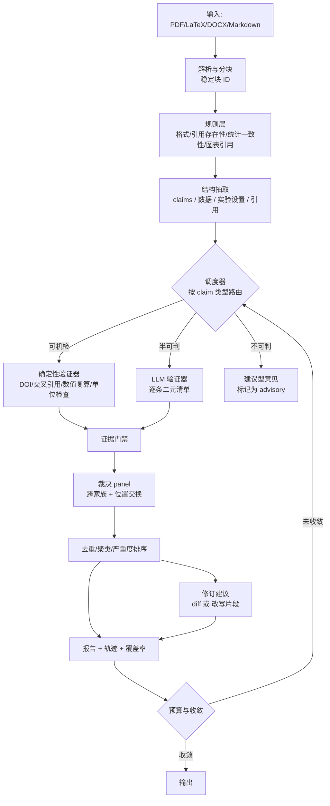

# PaperAudit 设计方案

> 多智能体论文审查与修订运行时 —— 结构对标 DelphiOpt，目标为工程可用，且相对单次 LLM 调用有可验证的质量提升。

- 版本：v1（方案评审稿）
- 日期：2026-09-22
- 状态：待评审，未开始编码

---

## 0. 一句话定位

**PaperAudit 是一个「可验证的论文审查流水线」，不是"多智能体辩论生成评审意见"。**

它的核心主张不是"我们让多个 Agent 讨论"，而是：

> **审查质量的上限由「能否把一条意见变成可判定的验证任务」决定，而不是由 Agent 数量决定。**
> 因此，我们把审查拆成**发现（生成）**与**裁决（验证）**两个解耦的阶段，只在有裁决器的地方才允许结论落地，其余一律降级为"建议/存疑"。

这是与 DelphiOpt 方法论上的一脉相承：DelphiOpt 只回写通过**正确性门禁 + 重复性能门禁**的补丁；PaperAudit 只输出通过**证据门禁 + 裁决门禁**的意见。

---

## 1. 为什么不直接丢给一个 LLM（基于已有实证的论证）

这一节是整个设计的存在理由。如果论证不成立，这个项目就没有必要做。

### 1.1 直接调用的三个结构性缺陷

| 缺陷 | 表现 | 根因 |
|---|---|---|
| **覆盖不可控** | 单次调用只检查模型"恰好想到"的维度；换一次调用，漏检的维度就变了 | 没有显式的检查清单，覆盖率是随机的 |
| **幻觉不可控** | 编造引用、编造"原文并未出现的表述" | 没有证据锚定（evidence grounding）机制 |
| **无法估错** | 你拿到 15 条意见，不知道哪 3 条是错的 | 没有裁决与置信度机制，精度未知 |

### 1.2 来自实证文献的四条关键事实

这四条直接决定了架构选择，不是设计者的主观偏好。

**（1）瓶颈在「定位错误」，不在「修复错误」** —— RefineBench (arXiv:2511.22173)

- 自由形式的开放式任务上，**自我精炼几乎无效**：Gemini 2.5 Pro 5 轮仅 +1.8%（29.5% → 31.3%），GPT-5 几乎零增长，部分模型越改越差。
- **但一旦明确告知"哪些项没达成"，性能急剧上升至接近满分**（大模型 5 轮内可达）。
- 结论：**"识别"是瓶颈，"修复"不是。** 因此**不能把"让 Agent 自己再读一遍论文找问题"当作主要手段**（这是绝大多数朴素 multi-agent 论文审查项目的做法，也是它们天花板低的原因）；必须靠**外部生成的显式清单**去驱动。

→ **架构对应**：`checklist` 模块是**一等公民**，且必须支持**外部导入**（会议检查清单、期刊要求、导师给的审查模板），而不是让 Agent 自己凭空生成。

**（2）误报率（FPR）而非召回率决定可用性** —— HALLMARK (arXiv:2607.18360)

- 在**贴近真实场景的低发生率**下，"一个验证器的告警里有多少是真阳性"几乎完全由 FPR 决定，而非召回率。
- 多数 LLM 对**训练截止之后**的文献严重过度告警。
- 原文结论："**FPR is the deployment bottleneck**"。

→ **架构对应**：整个系统以 **precision-first（精度优先）** 为目标函数，而不是"尽量多找问题"。这直接否决了"多找总比漏掉好"的直觉设计。**默认必须输出弃权（abstain）选项**，不允许 LLM 被迫二选一。

**（3）引用类事实高度可机检，且当前模型失败率惊人** —— CiteAudit (arXiv:2602.23452)

- 仅 2025 年就在 250 万篇论文中发现约 **14.69 万条 AI 生成的虚假引用**。
- 控制实验中 GPT-4o 生成的引用 **19.9% 是完全虚构的**。
- NeurIPS 2025 的 100 条幻觉引用中，**66% 是彻底捏造**，且**每一条都同时包含多种错误**（作者不对 + 标题不对 + 会议不对）。
- 多智能体流水线（抽取 claim → 检索证据 → 匹配 → 裁决）**显著优于单模型基线**。

→ **架构对应**：引用核验是**唯一能做到高确定性的模块**，必须是**工具优先（tool-first）**而非 LLM 优先——先走 DOI/ Crossref/ Semantic Scholar 查证，LLM 只负责语义对齐（claim 是否真被该文献支持）。

**（4）LLM 评判者本身有可测量的系统性偏差** —— Justice or Prejudice? (arXiv:2410.02736) 等

- 位置偏差 5–15%、自我偏好 5–10%、冗长偏好、谄媚、极端值/整数疲劳。
- 最有效的缓解手段：**跨模型家族评判**（评 Anthropic 的输出用 OpenAI 的模型）、**位置交换并双重判定**、**二元清单而非开放式打分**、**拒绝开放式整数评分**。
- Panel of LLM evaluators（PoLL）：多个小模型组成的评审团，与人类判断的相关性优于单个 GPT-4 评判者，且成本低一个数量级。

→ **架构对应**：`judge` 模块必须实现 **位置交换 + 跨家族 + 二元清单 + 显式 abstain**，并**禁止**开放式整数评分。

### 1.3 因此，质量提升的来源是什么（可复述的三句话）

1. **把开放式任务转化为可判定的验证任务** —— 只有能被机械或半机械验证的意见才进入最终报告。
2. **用显式清单替代模型的自发回想** —— 覆盖率从"随机"变成"可审计、可达标"。
3. **用裁决器替代模型的自评** —— 精度从"未知"变成"可测量、可回归"。

三者对应的可测量指标分别是 **覆盖率、FPR、以及意见与人类专家意见的一致性**。

---

## 2. 与 DelphiOpt 的结构对应关系

保留令人熟悉的心智模型，降低理解成本；差异处标注为什么不照搬。

| DelphiOpt | PaperAudit | 说明 |
|---|---|---|
| `optimize` | `audit` | 主命令 |
| 项目快照 snapshot | 稿件快照（分块 + 稳定 ID） | **新增：分块是核心资产**，所有证据定位依赖它 |
| AST 静态分析 + profiler | 规则层（正则/统计/格式/引用存在性） | **提前到 LLM 之前**，零成本先扫一遍 |
| 异构专家池 | 异构审查者池（方法学/统计/实验/写作/伦理/领域） | 保留 |
| Delphi 匿名聚合 | **Discover → Verify 双阶段** | **关键差异**：DelphiOpt 的候选有客观门禁，论文审查没有；所以把"裁决"提升为独立阶段 |
| 正确性门禁 | **证据门禁**（每条意见必须带引文锚点） | 对应 |
| 重复基准 + 置信区间 | **裁决器 panel + 位置交换** | 对应；用评判置信替代统计置信 |
| `adaptive_voi` 调度 | **按 claim 类型路由到最便宜的可裁决验证器** | 对应，且更彻底 |
| 全局预算账本 | 全局预算账本（成本/Token/时延/调用/工具） | 保留 |
| 统一 diff + 沙箱 | 修订建议补丁（unified diff，只针对文本） | 保留（写作类问题） |
| 证据轨迹 + HTML 报告 | 证据轨迹 + **HTML 审查报告** | 保留 |
| 信誉持久化 | **清单覆盖率 + 裁决准确率持久化** | 从"专家信誉"改为"清单项可靠性" |
| Mock Provider | Mock Provider（离线可跑，无需 API Key） | **必须有**，否则无法开发与回归 |

**不照搬的两处：**

- DelphiOpt 的 `debate` 模式（互相看答案）在论文审查里**有害**：会造成意见同质化与从众，且引入无法验证的社会性偏置。默认模式改为 **独立并行 + 匿名去重 + 裁决**，辩论作为可选消融项保留。
- DelphiOpt 的接受判据是"加速比 + 稳定性"这种**单一标量**；论文审查是**多维**的（正确性/新颖性/清晰度/可复现性）。因此不能用一个总分，必须**按清单维度分别裁定**。

---

## 3. 系统架构



### 3.1 四个阶段的划分

**Stage 0 · Ingest（解析与分块）**
产出 `Document`：带稳定 ID 的块序列（`sec_3.p2.s1` 形式），保留页码、章节层级、图表位置、公式编号。**这是整个系统的地基**——没有稳定块 ID，后面的"引文锚点"无法验证，FPR 会失控。

**Stage 1 · Discover（发现）**
- **规则层先行**：零 LLM 成本，能抓格式、引用存在性、图表编号错引、单位不一致、统计量自相矛盾（如 `p = 0.052` 却写"significant"）。
- **异构审查者并行**：每位审查者带**不同的显式清单**（来自 `checklists/`），只输出**结构化问题条目**，不输出散文评审意见。
- 输出 schema 强制：`{checklist_id, block_id, span, verbatim_quote, issue_type, severity, rationale, suggested_fix}`。
- **`verbatim_quote` 必须能在原文中精确匹配**——匹配失败的条目直接丢弃（这是最便宜、最有效的幻觉过滤器）。

**Stage 2 · Verify（裁决）**
- 按 `issue_type` 路由（见 §5）：确定性验证器 > 检索验证器 > LLM 二元清单。
- LLM 裁决走 **panel + 位置交换**：至少两个不同模型家族，A/B 双序各判一次，**两次不一致即判为 `contested`**，降级为"存疑"而非"缺陷"。
- 输出 `verdict ∈ {confirmed, contested, refuted, unverifiable}` + 置信度。

**Stage 3 · Revise（修订）**
- 只对 `confirmed` 且类型为写作/表述类的条目生成修订。
- 生成 unified diff 而非整段重写（避免顺手引入新问题）；改名、改结论这类**语义变更一律标记为需人工确认**。
- 修订后**重跑规则层**做回归（防止"改了引用编号导致全文错位"）。

**Stage 4 · Report（报告）**
- 分层输出：`confirmed`（高置信问题）/ `contested`（需人工判断）/ `advisory`（不可判，仅供参考）。
- **必须输出覆盖率**：每张清单有多少项被实际检查过。这直接回应 §1.2(1) 的瓶颈。
- 输出每条意见的证据链（原文引文 → 验证方式 → 裁决记录），可逐条复查。

---

## 4. 目录结构

```
PaperAudit/
├─ src/paperaudit/
│  ├─ models.py          # Document/Block/Issue/Verdict/Budget/Checklist 等类型化模型
│  ├─ ingest.py          # PDF/LaTeX/DOCX/MD 解析 → 稳定块 ID
│  ├─ chunking.py        # 分块策略、块 ID 生成与稳定性保证
│  ├─ rules/             # 规则层（无 LLM）
│  │  ├─ format.py       #   格式/结构
│  │  ├─ citation.py     #   引用存在性、编号连续性
│  │  ├─ stats.py        #   统计量一致性（p 值/自由度/样本量/百分比和）
│  │  └─ crossref.py     #   图表/公式/章节交叉引用
│  ├─ claims.py          # 结构抽取：claims、数据表、实验设置、引用清单
│  ├─ reviewers.py       # 异构审查者编排（并行 + 独立）
│  ├─ verifiers/
│  │  ├─ deterministic.py#   DOI/Crossref/S2 查证、数值复算、单位换算
│  │  ├─ retrieval.py    #   证据检索 + claim-证据对齐
│  │  └─ llm_adjudicator.py # 二元清单式 LLM 裁决
│  ├─ panel.py           # 裁决 panel：跨家族、位置交换、一致性聚合
│  ├─ scheduler.py       # 按 claim 类型路由 + 预算感知 VOI
│  ├─ budget.py          # 全局账本
│  ├─ revise.py          # 修订建议生成 + 回归检查
│  ├─ provenance.py      # 证据链：引文锚点、匹配校验、可追溯
│  ├─ telemetry.py       # JSONL/SQLite 轨迹
│  ├─ reporting.py       # HTML 报告（含覆盖率面板）
│  └─ cli.py             # paperaudit audit|inspect|report|reproduce|checklists
├─ checklists/           # ★ 显式清单（一等公民）
│  ├─ general.yaml       #   通用（清晰度/结构/可复现性）
│  ├─ statistics.yaml    #   统计报告规范（含 p 值、效应量、多重比较）
│  ├─ citations.yaml     #   引用规范
│  └─ venues/            #   会议/期刊特定
├─ configs/              # 配置样例（mock / real-providers）
├─ corpus/               # 评测语料（见 §7）
│  ├─ papers/            #   论文 + 元数据
│  ├─ gold/              #   人工标注：真问题 + 已修正版本
│  └─ injected/          #   注入式语料（生成，带已知 ground truth）
├─ analysis/             # 评测与消融脚本
├─ tests/                # 单元 + 集成 + 回归
└─ docs/
```

---

## 5. 核心技术设计

### 5.1 调度：按「可裁决性」路由（本项目的性能来源）

这是替代 DelphiOpt「按难度分配算力」的关键机制。**核心洞察：不同问题的验证成本差异达 3 个数量级，把预算花在验证成本低的问题上收益最高。**

| claim 类型 | 验证器 | 成本 | 可靠性 | 典型示例 |
|---|---|---|---|---|
| 引用存在性 | DOI/Crossref 查询 | ~0 | **确定** | 引用了不存在的论文 |
| 数值/单位一致性 | 纯计算 | ~0 | **确定** | "准确率 95%" 但表中 94.7%；单位 ml/L 混用 |
| 统计量一致性 | 纯计算（p 值↔统计量↔自由度） | ~0 | **确定** | `p = 0.049` 与 `t(28)=2.05` 不自洽 |
| 交叉引用 | 规则匹配 | ~0 | **确定** | 图 3 被引用但全文无图 3 |
| claim–引用对齐 | 检索 + LLM 二元判定 | 低 | 高 | 引用的文献并不支持该论断 |
| 方法描述完整性 | LLM 对照清单 | 中 | 中 | 未报告随机种子、未说明缺失值处理 |
| 结论是否过强 | LLM 对照证据 | 中 | **中低** | 相关当因果 |
| 新颖性 | 检索 + LLM | **高** | **低** | 与已有工作重复 |

**调度规则**：
1. 预算充足时，自上而下全跑。
2. 预算紧张时，**优先跑表格上部的确定性验证器**——它们不是"便宜的近似"，而是**精度更高**且**成本更低**，属于严格占优。
3. 表格下部的低可靠性类型（新颖性）**默认只输出 advisory**，不进入 confirmed 集合。

这条规则是"多 Agent 优于单次调用"的**主要可测量来源**：单次调用根本不会去查 DOI、不会复算 p 值。

### 5.2 证据门禁（幻觉过滤）

每条意见必须通过：
1. `verbatim_quote` 在原文中**精确子串匹配**（允许空白归一化，不允许模糊匹配）；
2. `block_id` 与 quote 的实际位置一致；
3. 若意见涉及外部事实（引用、常识），必须附验证器返回的**可复核标识**（DOI、检索 URL、计算结果）。

任一失败 → 该条目降级为 `unverifiable`，**不计入 confirmed**，但保留在轨迹中（便于分析模型幻觉模式）。

### 5.3 裁决 panel 的实现约束（照搬实证结论）

```
禁止：
  ✗ 开放式整数评分（"1-5 分"）→ 整数疲劳/极端值偏差
  ✗ 同家族模型自评          → 自我偏好 5-10%
  ✗ 单次单向判定            → 位置偏差 5-15%

强制：
  ✓ 二元清单（Yes / No / Cannot Assess）
  ✓ 位置交换 + 双向判定，不一致 → contested
  ✓ 跨模型家族（至少 2 个家族）
  ✓ "提取 → 比对"顺序，禁止先下结论再找理由
  ✓ 聚合在代码里做，不让 LLM 汇总分数
```

每次裁决调用记录：`judge_model`、`position`、`verdict`、`raw_json`。位置交换的两条记录**都要留痕**，便于事后做偏差审计。

### 5.4 预算与停止条件

沿用 DelphiOpt 的全局账本思路，但停止条件是多维的：

- **覆盖率达标**：目标清单项覆盖率达到阈值（如 85%）。
- **边际收益衰减**：连续 N 轮没有新增 `confirmed` 条目。
- **预算耗尽**：成本/Token/时延/调用数任一触顶。
- **无新增可裁决 claim**：剩下的都是 advisory 类型，继续跑无意义。

---

## 6. 质量提升的量化验证方案（≥30% 的论证基础）

**必须能回答："比单次 LLM 好在哪，好多少。"**

### 6.1 评测语料

三类，规模递增：

1. **注入式（injected）** —— 从干净论文出发，程序化注入**已知类型**的错误（改一个数字、删一条引用、把 p 值改成显著、单位混用、图号错位）。**自带 ground truth，可大规模生成，用于回归测试。** 这是覆盖率与召回率的可信来源。
2. **真实修订对（gold）** —— 论文的 arXiv v1 → v2（或投稿版 → 接收版），用版本差异作为"真实存在的问题"的代理标签。
3. **人工标注小样本** —— 50–100 条专家标注意见，用于测量**与人类专家的一致性**（最关键、也最贵的一项）。

### 6.2 对比条件（budget-matched）

沿用 DelphiOpt 的「预算匹配」原则：**相同成本预算下比较**，否则结论无意义。

| 条件 | 说明 |
|---|---|
| `single_pass` | 一次调用，要求输出完整评审（**基线**） |
| `single_pass_strong` | 一次调用，但允许用最强的单模型（花光预算） |
| `self_refine` | 同一模型多轮自我精炼（**预期无效，作为对照**，见 RefineBench） |
| `multi_agent_debate` | 多 Agent 互相看答案讨论（**预期有害或无效**） |
| `paperaudit_shallow` | 本方案，仅 Stage 1（发现） |
| `paperaudit_full` | 本方案，完整流水线 |

### 6.3 指标

**主指标（回答"是否真的更好"）**

- `precision`（confirmed 条目中真实问题的比例）→ **首要指标**，对应 §1.2(2)
- `recall`（已知真实问题中被发现的fraction）
- `F1`、以及**成本归一化后**的 `F1/$`
- `human_agreement`（与专家标注的一致性，Cohen's κ 或 Kendall τ）

**辅助指标**

- `checklist_coverage`（清单项被实际检查的比例）
- `hallucination_rate`（未通过证据门禁的条目占比）
- `contested_rate`（裁决不一致比例，反映"问题本身的模糊程度"）
- 成本、Token、时延、调用次数
- `false_positive_rate`（**单独报告**，因为它是部署门槛）

### 6.4 预期的提升来源与幅度假设

> 以下为**假设**，需实测检验。写在这里是为了让方案可被证伪。

| 来源 | 预期影响 | 依据 |
|---|---|---|
| 确定性验证器（引用/数值/统计） | 这批问题的 recall 从 ~0 提升到接近 1 | 单次调用不会查 DOI |
| 显式清单驱动 | 覆盖率从随机 → 可达标；减少"漏检维度" | RefineBench：清单是瓶颈的解 |
| 证据门禁 | hallucination_rate 大幅下降 | 精确子串匹配是硬门槛 |
| 裁决 panel | precision 提升；FP 显著减少 | PoLL 与偏差缓解文献 |
| 调度器 | 同预算下把算力投到高收益问题 | 成本差 3 个数量级 |

**结论性判断（诚实版）**：在**可机检维度**上，提升是数量级的且几乎确定（因为基线根本不做）。在**判断性维度**（新颖性、结论强度）上，提升幅度会小得多，且可能只是"更有条理"而非"更对"。**因此方案的目标应表述为：把可验证的部分做到接近完备，把不可验证的部分明确标注为不可验证，而不是假装后者也能做好。** 这个诚实的边界，恰恰是它比"一个 LLM 写一篇评审"更有工程价值的根本原因。

---

## 7. 工程可用性要求

- **离线可跑**：Mock Provider 覆盖全流水线，CI 无需 API Key。`simulation: true` 标记沿用 DelphiOpt 约定。
- **确定性**：固定种子下，规则层与确定性验证器输出 bit-identical；LLM 层记录完整请求，支持 `reproduce`。
- **可恢复**：每次运行写 checkpoint，支持 `resume`。
- **可审计**：JSONL 轨迹逐条记录证据链，SQLite 支持程序化分析。
- **可回归**：注入式语料 + 指标快照，防止"改了 prompt 悄悄变差"。
- **不越权**：只产出**建议**，绝不自动改稿并提交；语义变更一律需人工确认。
- **合规**：不代替同行评议做决定；报告顶部固定声明"机器辅助意见，不构成评审结论"。

---

## 8. 需要你确认的关键决策点

这些会显著影响实现，请选择：

1. **输入格式优先级** —— 先支持 LaTeX 源（结构化最好、块 ID 最稳）还是 PDF（更通用但解析噪声大）？建议先 LaTeX + Markdown，PDF 作为二期。

2. **是否保留 `debate` 模式** —— 我建议默认关闭、仅作消融。你的意向？

3. **评测语料** —— 是否愿意投入建设 `corpus/gold`（arXiv 版本对）？这决定我们能否给出可信的提升数字。若不愿意，只能用注入式语料，指标会偏窄。

4. **主用场景** —— 是「投前自审（作者视角）」还是「评审辅助（审稿人视角）」？两者清单与严重度排序不同。

5. **是否包含修订生成** —— 只出意见，还是连改写 diff 一起出？后者工程量大，且需要更强的"不越权"约束。

6. **技术栈** —— 确认沿用 Python 3.11+ / 可选 Windows 桌面前端，还是先纯 CLI？
